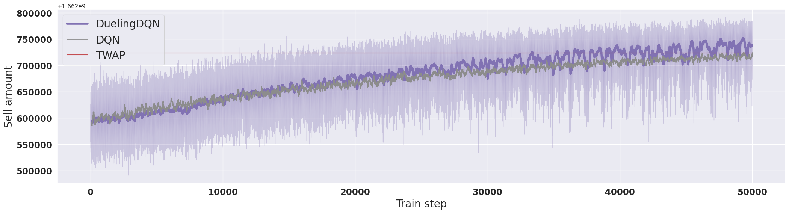
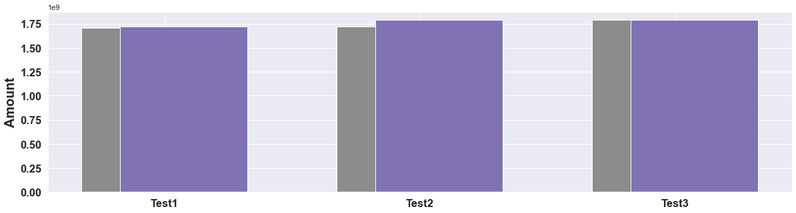

# Execution Optimization using Dueling DQN
- price level placement를 최적화화도록 강화학습
- market state만 사용 (주문 시점, 주문 수량은 고정)
- Time weighted average price를 벤치마크로 사용 
- Bitcoin limit order book data를 사용 <br>

# Overview




***코드 실행***

    # Run Felector algorithm
    python agent.py


```python
"""
학습을 위한 코드 작성
"""

s_dim = 23
a_dim = 10
rand = args.rand

config = {
    'waiting': args.waiting,
    'time_cut': args.time_cut,
    'target_volume': args.target_volume,
    'minima_volume': args.minima_volume,
    'episode': args.episode,
    'batch_size': args.batch_size,
    }

agent = Agent(s_dim, a_dim)
agent.train(config)
```

***모듈 설명***
- Simulator: 하나의 horizon에 대한 거래를 시뮬레이션하기 위한 시뮬레이터
- Agent: Dueling DQN 에이전트를 학습하고 학습 loop를 돌리기 위한 에이전트 클래스

***Market State***
- bid-ask spread = best ask - best bid
- mid price = (best ask + best bid) / 2
- market imbalance = sum(bid volumes) - sum(ask volumes)
- bid volumes
- ask volumes

***Actio Space***
- Bid price level (1~5)
- Ask price level (-5 ~ -1)

***Reward***
- o(executed price - executed at midprice)
